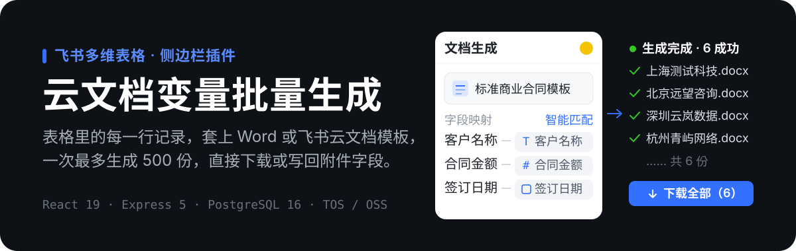
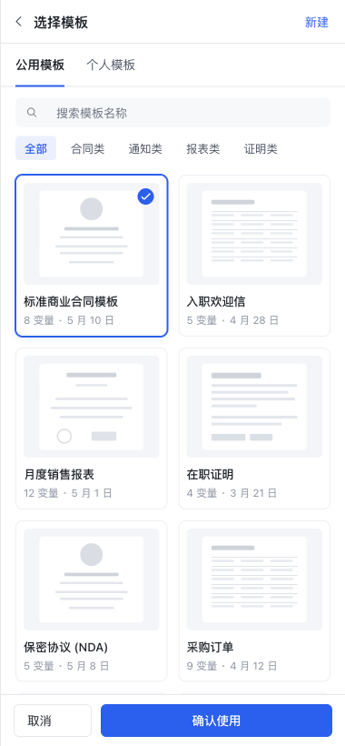
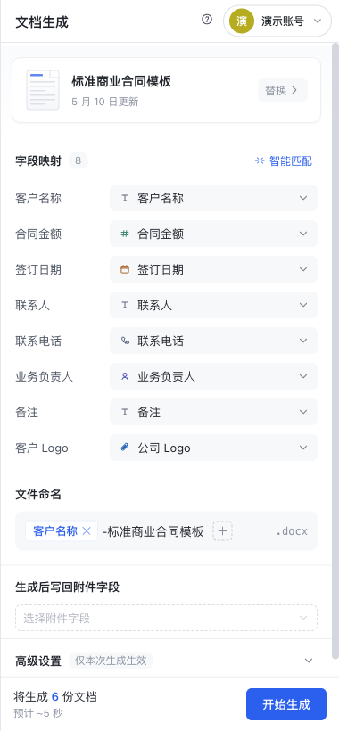
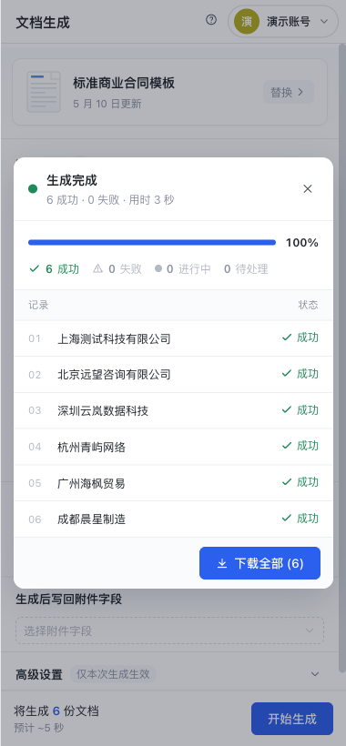
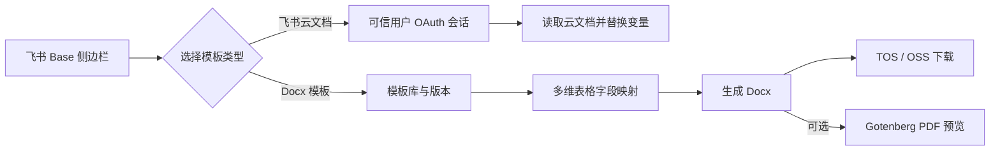

<p align="center">
  
</p>

<p align="center">
  
  
  
  
</p>

# 云文档变量批量生成

一个装在**飞书多维表格侧边栏**里的文档生成工具。表格里有 200 行客户记录，就能一次生成 200 份合同——模板写一次，剩下的交给字段映射。

生成结果可以打包下载，也可以写回多维表格的附件字段，让文档跟记录待在一起。

## 它长什么样

<p align="center">
  
  
  
</p>

<p align="center">
  <sub>① 挑模板 &nbsp;·&nbsp; ② 变量对字段（可智能匹配） &nbsp;·&nbsp; ③ 一次生成，逐条看结果</sub>
</p>

## 两条生成链路

两条链路共享侧边栏入口，但 API、权限和存储语义不同，**不能混用**。

| | 飞书云文档模板 | Word（Docx）模板资产 |
|---|---|---|
| **模板放在哪** | 用户自己的飞书云文档 / Wiki | 上传到服务端，成为带版本的 `templateId` |
| **靠什么授权** | 登录用户的 OAuth 权限 | API Key 或可信会话 |
| **产出** | 新的飞书云文档，链接写回表格 | `.docx` 存入 TOS / OSS，可选 Gotenberg 转 PDF 预览 |
| **适合谁** | 表格里临时套一份通知、证明 | 业务系统批量调用，模板要留档和版本管理 |

两条链路都认同一种写法：模板里写 `{{客户名称}}`，生成时替换成该行记录的字段值。数据来源可以是多维表格记录、固定值、链接和附件图片。

<details>
<summary><b>每条链路的具体步骤</b></summary>

**飞书云文档模板**

1. 已登录用户粘贴飞书云文档或 Wiki 模板链接；
2. 后端用当前用户 OAuth 会话提取 `{{变量}}`；
3. 前端自动匹配多维表格字段，也允许固定值/手动绑定；
4. 后端按记录复制并替换云文档内容；
5. 前端把生成结果写回附件字段。

边界：`/api/template/variables`、`/api/documents/generate` 和 `/api/users/search` 都要求服务端可信会话；只发 `X-Bitable-*` 宿主上下文头不能替代登录。

**Docx 模板资产**

1. 业务系统或已登录侧边栏创建模板资产，获得稳定 `templateId`；
2. 新版本以 `versionId` 保存，不指定版本时用当前激活版本；
3. 单份、同步批量或异步任务提交变量；
4. 服务端校验缺失/多余变量、Docx ZIP 安全与图片输入；
5. 生成文件写入对象存储并返回限时下载信息，可选生成 PDF 预览。

生产模板资产必须用 TOS，生成文件可用 TOS 或 OSS，本地存储仅用于开发。

</details>

本仓库不是通用办公套件，也不提供无鉴权的公网文档转换服务。

## 工作流程



### 登录是怎么建立的

侧边栏跑在 iframe 里，登录比普通网页麻烦。前端按这个顺序拿可信会话：

1. **复用**已有服务端会话；
2. 飞书 H5 能力可用时，用 `client-config` + `client-code` **端内免登**；
3. 端内免登不可用时，创建一次性 **OAuth handoff**，打开系统浏览器完成 OAuth，侧边栏轮询接回会话。

handoff 5 分钟过期、单次消费，并要求 Base `open_id` 与 OAuth 完成者 `open_id` 严格一致。

> **当前主界面不展示扫码入口。** `qr-config` / `qr-callback` 由服务端兼容保留，不是主流程；旧的 `/api/auth/feishu/:appKey/start` 和 `/login-status` 已退役并返回 410，不要与当前的 `/handoff/start`、`/handoff/:code` 混淆。

<details>
<summary><b>登录相关路由</b></summary>

| 方法 | 路径 | 说明 |
| --- | --- | --- |
| `GET` | `/api/auth/feishu/:appKey/client-config` | 返回客户端授权所需 app ID，不返回 secret |
| `POST` | `/api/auth/feishu/:appKey/client-code` | code 换用户 token 并创建会话 |
| `GET` | `/auth/feishu/:appKey/login`、`callback` | 外部 OAuth 跳转与回调 |
| `POST` | `/api/auth/feishu/:appKey/handoff/start` | 创建与 Base 用户绑定的一次性 handoff |
| `GET` | `/api/auth/feishu/:appKey/handoff/:code` | 单次消费 handoff 状态和 session |
| `GET` | `/auth/feishu/:appKey/qr-config`、`qr-callback` | 插件内扫码，兼容保留 |
| `GET` | `/api/auth/session` | 查询当前会话，不返回 session token |
| `POST` | `/api/auth/logout` | 删除会话并清理 cookie |
| — | 其它 `/auth/feishu/*`、`/api/auth/feishu/*` | 旧入口与未知子路径返回 410 |

浏览器 fallback 会把嵌入式 session token 存在 `localStorage`，仅对同源请求加 `X-Session-Token`。生产必须用 HTTPS、严格 CSP，并把 XSS 视为会话泄露风险。

</details>

## 本地跑起来

要求 Node.js 22（与 CI 一致），以及 Docker Compose。

**一条命令起全栈：**

```bash
cp .env.example .env
docker compose up -d --build
curl http://127.0.0.1:19094/api/health
```

Compose 里有应用（宿主 `127.0.0.1:19094`，容器 `3180`）、PostgreSQL 16（宿主 `127.0.0.1:15433`）和 Gotenberg 8（只在内网提供 PDF 转换，不映射宿主端口）。

**改前后端代码时：**

```bash
npm ci
docker compose up -d postgres gotenberg
cp .env.example .env
npm run dev
```

| 服务 | 地址 |
| --- | --- |
| Vite 前端 | `http://localhost:5173` |
| Express API | `http://localhost:3000` |
| 健康检查 | `http://localhost:3000/api/health` |

提交前至少跑这几条：

```bash
npm ci
npm run typecheck
npm test
npm run build:web
npm run verify:secrets
```

<details>
<summary><b>其它常用命令</b></summary>

| 命令 | 说明 |
| --- | --- |
| `npm run dev` | 启动本地依赖、前端与后端 |
| `npm run build` / `npm run start:prod` | 构建并以生产模式启动 |
| `npm run verify:oss` | 验证配置的输出对象存储 |
| `npm run verify:document-render-milestone1` | Docx 里程碑完整验证 |
| `npm run audit:document-render-milestone1` | 生成验收审计 |
| `npm run backup:postgres` | PostgreSQL 备份（`pg_dump -Fc`） |
| `npm run migrate:bitable-to-pg` | 多维表格配置迁移到 PostgreSQL |
| `npm run docker:up` / `docker:down` | 管理 Compose 栈 |

</details>

## 给业务系统用的 Docx API

侧边栏只是这套 API 的壳。外部系统可以直接调用，稳定契约以 [`docs/docx-api-integration.md`](docs/docx-api-integration.md) 为准。

鉴权接受 `Authorization: Bearer <DOCUMENT_RENDER_API_KEY>`、`x-api-key`，或已登录可信会话。开发环境未配 key 时允许本地调用；**生产环境缺 key 且无有效会话时返回 401**。

| 能力 | 端点 | 上限 |
|---|---|---|
| 创建模板资产 | `POST /api/v1/document-templates` | 单模板 20 MB |
| 模板列表 / 详情 / 版本 | `GET /api/v1/document-templates[/:id[/versions]]` | 列表返回当前版本变量与缩略图 |
| 新增并激活版本 | `POST /api/v1/document-templates/:templateId/versions` | — |
| 软删除模板 | `DELETE /api/v1/document-templates/:templateId` | `purge=true` 连对象一起删 |
| 单份生成 | `POST /api/v1/document-renders` | — |
| 同步批量 | `POST /api/v1/document-renders/batch` | 100 条 |
| 异步任务 | `POST /api/v1/document-render-jobs` | 500 条 |
| 任务进度 / 逐条结果 | `GET /api/v1/document-render-jobs/:jobId[/results]` | — |

变量策略：

- `missingStrategy=fail | blank`：缺少模板变量时失败还是填空；
- `unusedStrategy=error | ignore`：提交模板里不存在的变量时失败还是忽略，默认保护性失败；
- `output.includeFileBase64`：把文件内容随响应返回，适合受控的小文件调用；
- `output.includePdfPreview`：调用 Gotenberg 生成 PDF 预览。

异步任务不会内联返回 `fileBase64`，请使用 `download.url`。`X-Bitable-*` 只是宿主上下文，不能单独当认证凭据。

## 配置与数据

完整变量见 [`.env.example`](.env.example)，排障见 [`docs/docx-operator-runbook.md`](docs/docx-operator-runbook.md)。

| 分组 | 关键变量 | 说明 |
| --- | --- | --- |
| 飞书应用 | `FEISHU_*_APP_ID`、`FEISHU_*_APP_SECRET`、`FEISHU_REDIRECT_BASE` | 多应用登录与回调 |
| 租户 | `FEISHU_ALLOWED_TENANT_KEYS` | 生产必填 allowlist，空则拒绝登录 |
| 会话 | `SESSION_COOKIE_SECURE`、`SESSION_COOKIE_SAMESITE`、`SESSION_MAX_AGE_SECONDS`、`OAUTH_STATE_SIGNING_SECRET` | iframe cookie 策略与 state 签名 |
| 数据库 | `DATABASE_URL`、`POSTGRES_DATA_DIR` | 持久化与稳定数据目录 |
| Docx 鉴权 | `DOCUMENT_RENDER_API_KEY` | 服务到服务 API key |
| 模板存储 | `DOCUMENT_TEMPLATE_STORAGE_PROVIDER=tos`、`TOS_*` | 生产模板资产必须 TOS |
| 生成存储 | `DOCUMENT_RENDER_STORAGE_PROVIDER=tos\|oss` 与对应凭证 | 最终文件与签名下载 URL |
| 对象前缀 | `DOCUMENT_TOS_ROOT_PREFIX`、模板/生成 prefix | 项目与环境隔离 |
| PDF | `GOTENBERG_URL` | Docx → PDF 预览服务 |
| 配置门禁 | `DOCUMENT_RENDER_STRICT_CONFIG=true` | 生产关键配置缺失时拒绝启动 |
| CORS | `CORS_ALLOWED_ORIGINS` | 跨域部署的精确来源 allowlist |

生产必须显式配置 `OAUTH_STATE_SIGNING_SECRET`；缺失时实现会告警并退回用应用密钥签名，那不是推荐配置。配置自检默认只记录告警，生产建议开 `DOCUMENT_RENDER_STRICT_CONFIG=true`。

**PostgreSQL 表**（迁移在 `server/migrations/`，服务启动时执行）：

| 表 | 作用 |
|---|---|
| `users` | 飞书登录用户资料 |
| `auth_sessions` | 可信会话和用户 OAuth token |
| `saved_configs` | 用户的字段映射配置 |
| `render_jobs` | 异步任务状态、租约、进度和结果 |
| `render_audit` | 生成元数据审计，**不保存变量值** |
| `schema_migrations` | 已应用迁移版本 |

`/api/health` 里 `databaseReady:true` 才代表必需表齐全；`databaseConfigured:true` 仅代表存在连接串。

生产 PostgreSQL 数据目录必须放在 release/current 软链之外的稳定绝对路径。备份用 `npm run backup:postgres`（`POSTGRES_BACKUP_DIR`、`POSTGRES_BACKUP_KEEP_DAYS` 可调）。**备份不等于恢复验证。**

## 安全边界

- 这是公开仓库。任何应用 secret、OAuth token、session、数据库连接串、对象存储凭证、真实 Base / Table / Tenant ID 都不得进入 README、源码、日志样例或测试夹具。
- `X-Bitable-*` 是宿主上下文；其中 `X-Bitable-Open-Id` 用于绑定 handoff 发起者，但它本身不是登录凭据。
- `DOCUMENT_RENDER_API_KEY` 与登录 session 分离管理并定期轮换；禁止把 API key 放进浏览器 URL。
- 模板与图片下载默认禁止本机、内网、云元数据地址和非 HTTPS URL，并带大小与 ZIP 解压边界（zip bomb 防护）。
- 模板所有权和异步任务查询与提交身份绑定；管理员列表只通过环境变量注入。
- OAuth state 经过 HMAC 签名并有时效；登录改动必须覆盖 client-code、QR、OAuth/handoff、过期、身份不匹配和 iframe 会话恢复。
- TOS / OSS 签名 URL 有 TTL；客户端只使用 API 返回的 `download.url`，不要推断对象 key 或持久化过期 URL。
- `render_audit` 只记录模板、状态、计数、存储位置和调用方，**不记录变量值**。
- 仓库没有 LICENSE 文件，不应假定可自由再发布。

## 部署与当前状态

`.github/workflows/deploy-fbif-sidebar-docgen.yml` 在 `main` push 或手动触发时：安装依赖 → 类型检查 → 测试 → 构建前端 → 打包 release → 上传到版本化 release 目录 → 保持 PostgreSQL 稳定数据目录并重建 Compose → 轮询 `/api/health` 验证。

> **工作流存在不等于某次部署成功。** 应同时检查 Actions 结果、`databaseReady`、登录失败分支、对象存储签名下载、真实飞书侧边栏和附件回写。

截至 2026-07-17：

- 本地验证通过：`npm test` 330/330、`npm run build`、`npm run verify:secrets`。
- Vite 生产构建仍有约 1.12 MB 主 chunk 警告，不影响构建结果，待做按需拆分。
- 仓库包含部署工作流，但**没有证据证明当前提交已部署到生产**。
- 仍需外部环境验收：真实飞书桌面 Base 中的 client-code 与 OAuth handoff、真实 TOS 并发写入、生产 Docker / Gotenberg 链路。
- handoff 目前是单进程内存状态；多实例部署前必须改为共享存储或配置粘性路由。

## 项目结构

```text
.
├── src/                         # React 侧边栏与 Base SDK 适配
├── server/
│   ├── src/                     # Express、登录、云文档与 Docx API
│   └── migrations/              # PostgreSQL migration
├── scripts/                     # 开发、部署、备份与文档同步
├── docs/                        # API、架构、运维、ADR 与验收材料
├── .github/workflows/           # 测试后部署
├── docker-compose.yml           # app + PostgreSQL + Gotenberg
├── Dockerfile
└── .env.example
```

## 文档索引

| 文档 | 定位 |
|---|---|
| [`CLAUDE.md`](CLAUDE.md) | 唯一工程记忆、约束与未完成事项 |
| [`CONTEXT.md`](CONTEXT.md) | 两条生成链路、术语、路由与存储边界 |
| [`docs/handoff.md`](docs/handoff.md) | 当前交接状态与外部验收清单 |
| [`docs/docx-api-integration.md`](docs/docx-api-integration.md) | Docx API 权威契约与更新日志 |
| [`docs/docx-api-architecture.md`](docs/docx-api-architecture.md) | 模板、渲染、存储和身份架构 |
| [`docs/docx-operator-runbook.md`](docs/docx-operator-runbook.md) | 生产配置、监控、备份、恢复与排障 |
| [`docs/project-flow.md`](docs/project-flow.md) | 业务流程与字段语义 |
| [`docs/adr/`](docs/adr/) | 仍需保留的历史架构决策 |

`docs/design/` 是设计资产，不作为当前实现依据。仓库本地如存在 `docs/feishu-resources.md`，它是内部资源索引，提交前必须再次检查标识符和敏感信息。
