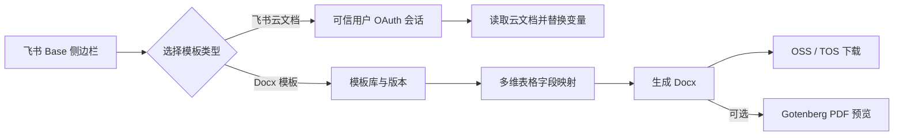

# 飞书侧边栏：云文档变量批量生成

这是一个运行在飞书多维表格侧边栏中的文档生成工具，包含两条相互独立的业务路径：

- **飞书云文档模板**：读取当前登录用户有权限访问的云文档，以多维表格记录替换 `{{变量}}`。
- **Word（Docx）模板库**：上传、版本化和批量填充 `.docx`，生成文件写入 OSS 或 TOS，并可按需经 Gotenberg 生成 PDF 预览。

当前实现是 React 19 + TypeScript + Vite 7 前端、Express 5 后端、PostgreSQL 16、TOS/OSS 和 Gotenberg 8。项目工程规则以 [`CLAUDE.md`](CLAUDE.md) 为准，当前实现与验收缺口见 [`CONTEXT.md`](CONTEXT.md) 和 [`docs/handoff.md`](docs/handoff.md)；本 README 只提供使用入口。

## 当前状态

截至 2026-07-17：

- 本地验证：`npm test` 330/330 通过，`npm run build` 通过，`npm run verify:secrets` 通过。
- Vite 生产构建仍有约 1.12 MB 主 chunk 警告，不影响构建结果，但需要后续做按需拆分。
- 仓库包含部署工作流，但**没有证据证明当前提交已部署到生产**。
- 真实飞书桌面 Base 中的 client-code 与 OAuth handoff、真实 TOS 并发写入、生产 Docker/Gotenberg 链路仍需外部环境验收。

## 核心流程


```mermaid
flowchart LR
  A["飞书 Base 侧边栏"] --> B{"选择模板类型"}
  B -->|"飞书云文档"| C["可信用户 OAuth 会话"]
  C --> D["读取云文档并替换变量"]
  B -->|"Docx 模板"| E["模板库与版本"]
  E --> F["多维表格字段映射"]
  F --> G["生成 Docx"]
  G --> H["OSS / TOS 下载"]
  G -->|"可选"| I["Gotenberg PDF 预览"]
```

### 登录链路

前端按以下顺序建立可信会话：

1. 复用已有服务端会话。
2. 飞书 H5 能力可用时，通过 `client-config` + `client-code` 端内免登。
3. 端内免登不可用时，创建一次性 OAuth handoff，打开系统浏览器完成 OAuth，再由侧边栏轮询接回会话。

当前主界面不展示扫码入口。`qr-config` / `qr-callback` 仍由服务端兼容保留，但不是主流程。旧 `/api/auth/feishu/:appKey/start` 和 `/login-status` 已退役并返回 410；不要与当前的 `/handoff/start`、`/handoff/:code` 混淆。

handoff 当前保存在单进程内存中，5 分钟过期、单次消费，并要求 Base `open_id` 与 OAuth 完成者 `open_id` 严格一致。真实飞书环境必须验证两者是否处于同一 open_id 命名空间；多实例部署则需要共享存储或粘性路由。

详见 [`CONTEXT.md`](CONTEXT.md) 和 [`docs/docx-api-architecture.md`](docs/docx-api-architecture.md)。

## 本地启动

### 环境要求

- Node.js `^20.19.0` 或 `>=22.12.0`（Vite 7 的实际约束）。
- CI 使用 Node 22；Docker 运行镜像使用 Node 20。
- Docker 与 Docker Compose（用于 PostgreSQL 和可选的完整本地编排）。

### 启动开发环境

```bash
cp .env.example .env
npm install
docker compose up -d postgres
npm run dev
```

默认地址：

- 前端：`http://localhost:5173`
- 后端：`http://localhost:3000`
- 健康检查：`http://localhost:3000/api/health`
- PostgreSQL：`127.0.0.1:15433`

不要把真实应用密钥、OAuth token、数据库连接串、对象存储凭证或真实 Base/Table/Tenant 标识提交到仓库。

## 常用命令

| 命令 | 用途 |
|---|---|
| `npm run dev` | 启动 PostgreSQL 并并行运行前后端 |
| `npm run typecheck` | TypeScript 类型检查 |
| `npm test` | 前后端 Node test 全量测试 |
| `npm run build` | 类型检查并构建前端 |
| `npm run verify:secrets` | 扫描 Git 已跟踪文件中的密钥风险 |
| `npm run verify:oss` | 验证配置的输出对象存储 |
| `npm run verify:document-render-milestone1` | 执行 Docx 里程碑完整验收 |
| `npm run backup:postgres` | 创建 PostgreSQL 备份 |
| `npm run docker:up` | 启动完整 Compose 编排 |

提交前至少运行：

```bash
npm test
npm run build
npm run verify:secrets
git diff --check
```

## 配置概览

完整变量和故障排查见 [`docs/docx-operator-runbook.md`](docs/docx-operator-runbook.md)。关键配置包括：

| 领域 | 关键变量 |
|---|---|
| 飞书登录 | `FEISHU_FBIF_APP_ID`、`FEISHU_FBIF_APP_SECRET`、`FEISHU_REDIRECT_BASE`、`FEISHU_ALLOWED_TENANT_KEYS` |
| 会话 | `SESSION_COOKIE_*`、`SESSION_MAX_AGE_SECONDS`、`OAUTH_STATE_SIGNING_SECRET` |
| 数据库 | `DATABASE_URL`、`POSTGRES_DATA_DIR` |
| Docx API | `DOCUMENT_RENDER_API_KEY` |
| 模板存储 | `DOCUMENT_TEMPLATE_STORAGE_PROVIDER=tos`、TOS 凭证和前缀 |
| 生成文件 | `DOCUMENT_RENDER_STORAGE_PROVIDER=oss|tos`、对应对象存储凭证 |
| PDF 预览 | `GOTENBERG_URL` |

生产环境应显式配置 `OAUTH_STATE_SIGNING_SECRET`。缺失时实现会醒目告警并退回使用应用密钥签名，不是推荐的生产配置。

## API 与数据

### Docx API

稳定契约见 [`docs/docx-api-integration.md`](docs/docx-api-integration.md)。主要能力：

- 模板上传、列表、详情、版本与删除；
- 单份生成；
- 最多 100 条的同步批量生成；
- 最多 500 条的异步任务；
- 可选 PDF 预览；
- `missingStrategy=fail|blank` 和 `unusedStrategy=error|ignore`；
- 模板/图片 URL 的 SSRF 防护、20 MB 模板限制和 zip bomb 防护。

异步任务不会内联返回 `fileBase64`，应使用 `download.url`。生产 Docx API 必须使用 API Key 或可信登录会话，`X-Bitable-*` 不能单独作为认证凭据。

### PostgreSQL

迁移位于 `server/migrations/`：

| 表 | 作用 |
|---|---|
| `users` | 飞书用户资料 |
| `auth_sessions` | 可信会话和用户 OAuth token |
| `saved_configs` | 用户的字段映射配置 |
| `render_jobs` | 异步生成任务、所有者与执行租约 |
| `render_audit` | 生成元数据审计；不保存变量值 |
| `schema_migrations` | 已应用迁移版本 |

`/api/health` 中只有 `databaseReady:true` 才表示必需表齐全；`databaseConfigured:true` 仅表示存在连接串。

## 安全边界

- `X-Bitable-*` 是宿主上下文；其中 `X-Bitable-Open-Id` 还用于绑定 handoff 发起者，但它本身不是登录凭据。
- 浏览器写操作受来源校验保护；外部系统使用 API Key。
- OAuth state 使用 HMAC 签名；session 通过 httpOnly cookie 或受控的 `X-Session-Token` 兼容通道传递。
- 当前 handoff 身份不匹配路径仍会把完整身份标识写入服务端日志、放入接口错误响应，并在前端展示缩写诊断。修复前不要复制或分享相关日志、响应和截图，也不能把该错误路径视为已满足隐私要求。
- 模板与图片下载默认禁止本机、内网、云元数据地址和非 HTTPS URL。
- 生产模板必须存 TOS；生产生成文件必须存 OSS/TOS，不允许静默降级到本地。
- `render_audit` 只记录模板、状态、计数、存储位置和调用方，不记录变量值。

## 文档入口

| 文档 | 定位 |
|---|---|
| [`CLAUDE.md`](CLAUDE.md) | Agent 工程入口与不可破坏边界 |
| [`CONTEXT.md`](CONTEXT.md) | 新会话快速理解当前实现 |
| [`docs/handoff.md`](docs/handoff.md) | 当前交接状态与外部验收清单 |
| [`docs/docx-api-integration.md`](docs/docx-api-integration.md) | Docx API 稳定接入契约 |
| [`docs/docx-api-architecture.md`](docs/docx-api-architecture.md) | Docx 服务架构与安全边界 |
| [`docs/docx-operator-runbook.md`](docs/docx-operator-runbook.md) | 配置、部署、备份与排障 |
| [`docs/project-flow.md`](docs/project-flow.md) | 业务流程与字段语义 |
| [`docs/adr/`](docs/adr/) | 仍需保留的历史架构决策 |
`docs/design/` 属于设计资产，不作为当前实现依据。仓库本地如存在 `docs/feishu-resources.md`，它是内部资源索引，提交前必须再次检查标识符和敏感信息。
