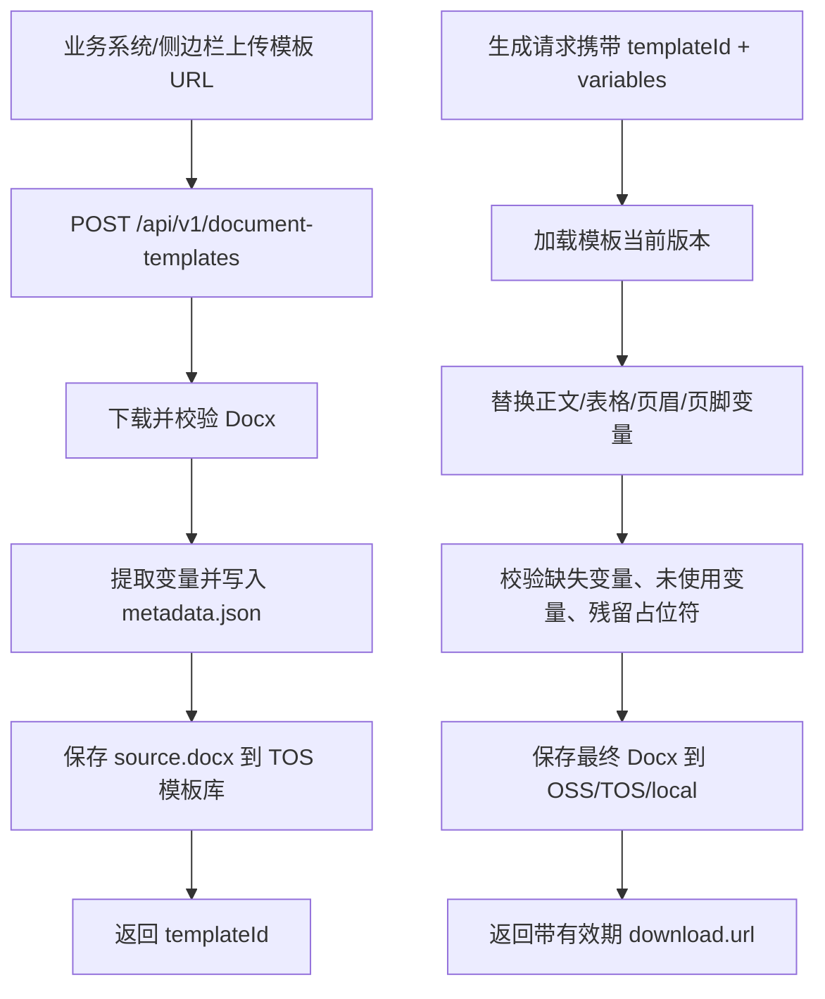

# Docx API 架构说明

更新时间：2026-05-12

## 模块划分

| 模块 | 文件 | 职责 |
|---|---|---|
| 单份生成 API | `server/src/documentRenderApi.ts` | 下载或加载模板、替换变量、保存生成文件、返回下载链接。 |
| 批量生成 API | `server/src/documentRenderBatchApi.ts` | 逐条调用单份生成逻辑，单条失败不影响其他记录。 |
| 异步任务 API | `server/src/documentRenderJobApi.ts` | 提交后后台执行，维护进度和结果。 |
| 模板管理 API | `server/src/documentTemplateApi.ts` | 上传、列表、查询、版本、删除模板资产。 |
| 模板服务 | `server/src/documentTemplateService.ts` | 生成 `templateId`/`versionId`、提取变量、维护 metadata/index。 |
| 模板对象存储 | `server/src/documentTemplateStorage.ts` | TOS 或本地开发目录读写模板资产。 |
| 输出对象存储 | `server/src/documentRenderTosStorage.ts` 和 `documentRenderApi.ts` | OSS/TOS/local 保存最终生成文件。 |
| 侧边栏 UI | `src/SidebarApp.tsx` | 服务器 Docx 模板库管理和多维表格批量生成入口。 |

## 数据流



## 模板资产结构

模板对象存储使用 `DOCUMENT_TEMPLATE_TOS_PREFIX`，默认 `document-templates`。

```text
document-templates/
├── _index.json
└── fbiftemp_20260512_001/
    ├── metadata.json
    └── versions/
        ├── v001/source.docx
        └── v002/source.docx
```

`metadata.json` 保存模板内部记录，包括原始 `sourceUrl`，只供服务端使用。公开 API 响应会移除 `sourceUrl`。

`_index.json` 是列表接口的轻量索引，包含 `templateId`、名称、状态、当前版本、版本数、变量列表、创建/更新时间。

## 版本策略

- 新模板的首个版本为 `${templateId}_v001`。
- `POST /api/v1/document-templates/:templateId/versions` 会追加新版本并设为当前版本。
- 生成请求不传 `versionId` 时使用 `activeVersionId`。
- 软删除后模板不能继续生成；`purge=true` 会删除 metadata 和版本对象。

## 生成策略

Docx 替换逻辑会处理：

- `word/document.xml`
- 表格内文本
- 页眉、页脚
- 脚注等 `word/*.xml` 相关部件
- Word 把 `{{变量}}` 拆成多个文本节点的情况

替换后会检查：

- 模板中出现但请求未提供的变量，返回 `missingVariables`。
- 请求提供但模板中未出现的变量，返回 `unusedVariables`。
- 输出文件仍残留 `{{变量}}`，拒绝生成半成品。
- zip bomb、伪装 Docx、坏 Docx、超 20MB 模板。

## 存储策略

| 对象 | 开发环境 | 生产环境 |
|---|---|---|
| 模板资产 | 无 TOS 时可落本地目录 | 必须配置 TOS，否则拒绝启动相关能力 |
| 生成文件 | 无 OSS/TOS 时可 local 降级 | 必须配置 OSS 或 TOS，不允许 local 降级 |

TOS 同时可用于模板资产和生成文件；生成文件也支持阿里云 OSS。

## 安全边界

- `DOCUMENT_RENDER_API_KEY` 开启后，业务系统必须传 API Key。
- 已登录侧边栏用户可用 httpOnly 登录会话调用同一组 Docx API。
- 默认禁止模板链接访问本机、内网、云元数据地址。
- 默认禁止非 HTTPS 模板链接。
- 错误响应只返回用户可理解原因，不暴露内部堆栈。
- 受跟踪密钥扫描覆盖 OSS/TOS 关键变量，报告只输出变量名和文件路径。

## 已知实现边界

- 异步任务当前存放在进程内存中，适合当前单进程服务和短期查询；如果后续要求服务重启后仍可查询任务历史，应把 job 状态持久化到 PostgreSQL 或对象存储。
- `src/SidebarApp.tsx` 是历史遗留的大文件，已超过项目约定的 900 行。继续扩展前端时应优先拆出模板库、字段映射、生成进度等组件。
