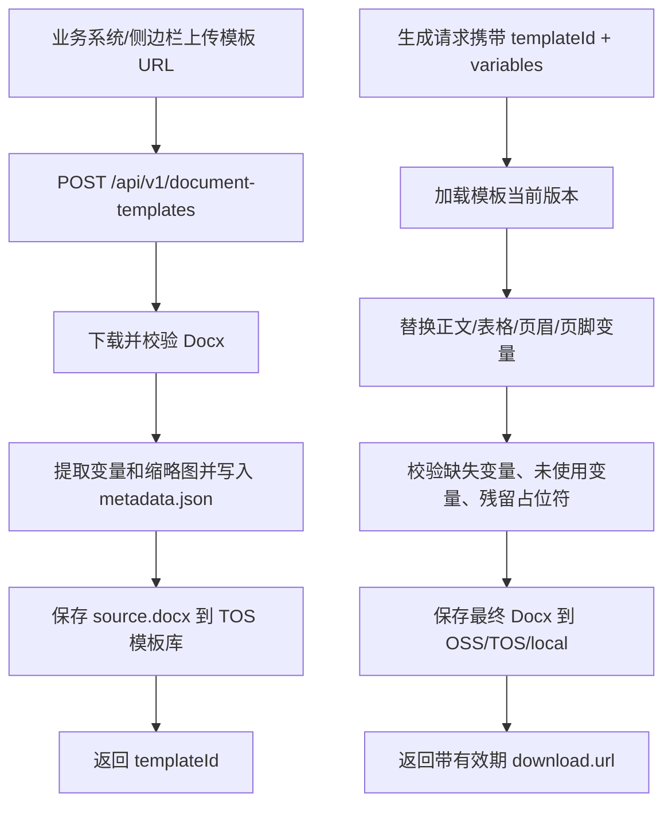
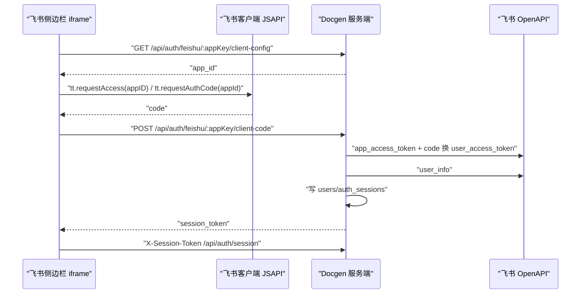
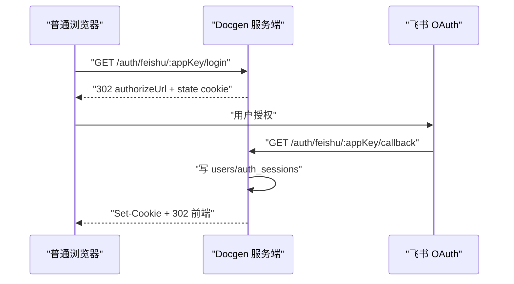

# Docx API 架构说明

更新时间：2026-05-15

## 模块划分

| 模块 | 文件 | 职责 |
|---|---|---|
| 单份生成 API | `server/src/documentRenderApi.ts` | 下载或加载模板、替换变量、保存生成文件、返回下载链接。 |
| 批量生成 API | `server/src/documentRenderBatchApi.ts` | 逐条调用单份生成逻辑，单条失败不影响其他记录。 |
| 异步任务 API | `server/src/documentRenderJobApi.ts` | 提交后后台执行，维护进度和结果。 |
| 模板管理 API | `server/src/documentTemplateApi.ts` | 上传、列表、查询、版本、删除模板资产。 |
| 模板服务 | `server/src/documentTemplateService.ts` | 生成 `templateId`/`versionId`、提取变量和缩略图、维护 metadata/index。 |
| 模板对象存储 | `server/src/documentTemplateStorage.ts` | TOS 或本地开发目录读写模板资产。 |
| 输出对象存储 | `server/src/documentRenderTosStorage.ts` 和 `documentRenderApi.ts` | OSS/TOS/local 保存最终生成文件。 |
| 侧边栏 UI | `src/components/document-generator/` | 服务器 Docx 模板库管理和多维表格批量生成入口。 |
| 飞书登录 | `server/src/oauthRoutes.ts`、`server/src/auth.ts`、`src/feishuClientLogin.ts`、`src/authSessionToken.ts` | 飞书客户端内授权、普通浏览器 OAuth 当前页跳转、嵌入式 session token 兜底和真实侧边栏登录态接回。 |
| 数据库迁移 | `server/migrations/` + `server/src/migrations.ts` | 管理 PostgreSQL 表结构版本，启动时记录到 `schema_migrations`。 |

## 数据流



## 数据模型

PostgreSQL schema 由 `server/migrations/` 管理，启动时通过 `server/src/migrations.ts` 执行未应用版本，并写入 `schema_migrations`。

| 表 | 关键字段 | 职责 |
|---|---|---|
| `users` | `open_id`、`name`、`email`、`avatar_url` | 保存飞书登录用户资料。 |
| `auth_sessions` | `token`、`oauth_app_key`、`open_id`、`access_token`、`refresh_token`、`expires_at` | 保存侧边栏 httpOnly 登录会话和 OAuth token。 |
| `saved_configs` | `id`、`open_id`、`config_name`、`payload_json` | 保存用户模板映射配置；同一用户同一配置名只保留一份。 |
| `schema_migrations` | `version`、`name`、`applied_at` | 记录已执行 migration，避免重复执行 DDL。 |

## 模板资产结构

TOS 对象存储支持统一项目根目录 `DOCUMENT_TOS_ROOT_PREFIX`。生产建议按项目和环境分层，例如 `fbif-sidebar-docgen/prod`；未配置时保留历史根目录，避免影响已有对象。

```text
fbif-sidebar-docgen/
└── prod/
    ├── templates/
    │   ├── _index.json
    │   └── fbiftemp_20260512_001/
    │       ├── metadata.json
    │       └── versions/
    │           ├── v001/source.docx
    │           └── v002/source.docx
    └── renders/
        ├── 2026/05/13/req-001.docx
        └── diagnostics/2026/05/13/1747100000000-a1b2.txt
```

模板对象存储使用 `DOCUMENT_TEMPLATE_TOS_PREFIX`，推荐值为 `templates`；生成文件使用 `DOCUMENT_RENDER_TOS_PREFIX`，推荐值为 `renders`。如果没有配置 `DOCUMENT_TOS_ROOT_PREFIX`，这些前缀仍可单独作为 bucket 根目录下的一级目录使用。

`metadata.json` 保存模板内部记录，包括原始 `sourceUrl`、变量列表和缩略图结构，只供服务端使用。公开 API 响应会移除 `sourceUrl`。

`_index.json` 是列表接口的轻量索引，包含 `templateId`、名称、状态、当前版本、版本数、变量列表、当前版本缩略图、创建/更新时间。

## API 契约优先

Docx API 是本项目底层契约。新增能力必须先更新 `docs/docx-api-integration.md`，并在文档开头的「更新日志」表格追加记录，再实现后端 API 和侧边栏消费逻辑。

侧边栏、脚本和其它工具都只能消费 API 暴露的稳定字段。模板缩略图这类核心能力应由模板 API 返回 `thumbnail`，不能只在前端按模板 ID 或模板名称临时生成占位图。

## 版本策略

- 新模板的首个版本为 `${templateId}_v001`。
- `POST /api/v1/document-templates/:templateId/versions` 会追加新版本并设为当前版本。
- 生成请求不传 `versionId` 时使用 `activeVersionId`。
- 软删除后模板不能继续生成；`purge=true` 会删除 metadata 和版本对象。

## 生成策略

Docx 替换逻辑会处理：

- `word/document.xml`
- 表格内文本
- 页眉、页脚
- 脚注等 `word/*.xml` 相关部件
- Word 把 `{{变量}}` 拆成多个文本节点的情况

替换后会检查：

- 模板中出现但请求未提供的变量，返回 `missingVariables`。
- 请求提供但模板中未出现的变量，返回 `unusedVariables`。
- 输出文件仍残留 `{{变量}}`，拒绝生成半成品。
- zip bomb、伪装 Docx、坏 Docx、超 20MB 模板。

## 存储策略

| 对象 | 开发环境 | 生产环境 |
|---|---|---|
| 模板资产 | 无 TOS 时可落本地目录 | 必须配置 TOS，否则拒绝启动相关能力 |
| 生成文件 | 无 OSS/TOS 时可 local 降级 | 必须配置 OSS 或 TOS，不允许 local 降级 |
| PostgreSQL 数据 | 未设置 `POSTGRES_DATA_DIR` 时使用 Docker named volume | 部署脚本固定到 `{APP_DIR}/data/postgres`，不能跟随 release 目录 |

TOS 同时可用于模板资产和生成文件；生成文件也支持阿里云 OSS。

PostgreSQL 表结构通过 `server/migrations/` 管理，服务启动时执行未应用版本并写入 `schema_migrations`。生产部署前应先确认数据库备份可恢复。

## 登录链路

飞书桌面侧边栏优先走客户端内授权，不应把用户带离当前插件面板。主链路是：



普通浏览器 OAuth 走 `/auth/feishu/:appKey/login` 当前页跳转，由回调设置 httpOnly cookie。飞书桌面侧边栏内不再自动打开外部授权页；此前 `/api/auth/feishu/:appKey/start` + `/login-status` 的 JSON handoff 会让“知道 state 的发起者”领取授权者 session，已停用并固定返回 410。



服务端解析会话时按 cookie、`X-Session-Token`、Bearer 收集候选值；如果旧 cookie 查不到有效 session，会继续尝试后续 token。query token 已移除，避免 token 出现在 URL、日志或分享链路里。

## 安全边界

- `DOCUMENT_RENDER_API_KEY` 开启后，业务系统必须传 API Key。
- 已登录侧边栏用户可用 httpOnly 登录会话调用同一组 Docx API。
- 默认禁止模板链接访问本机、内网、云元数据地址。
- 默认禁止非 HTTPS 模板链接。
- 错误响应只返回用户可理解原因，不暴露内部堆栈。
- 受跟踪密钥扫描覆盖 OSS/TOS 关键变量，报告只输出变量名和文件路径。

## 已知实现边界

- 异步任务当前存放在进程内存中，适合当前单进程服务和短期查询；如果后续要求服务重启后仍可查询任务历史，应把 job 状态持久化到 PostgreSQL 或对象存储。
- 侧边栏当前已拆到 `src/components/document-generator/`，但 `PrimaryScreen.tsx` 和 `_design.css` 仍偏大。继续扩展前端时应优先按模板库、字段映射、生成进度等边界拆分。
